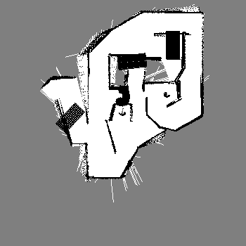
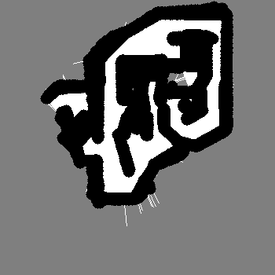
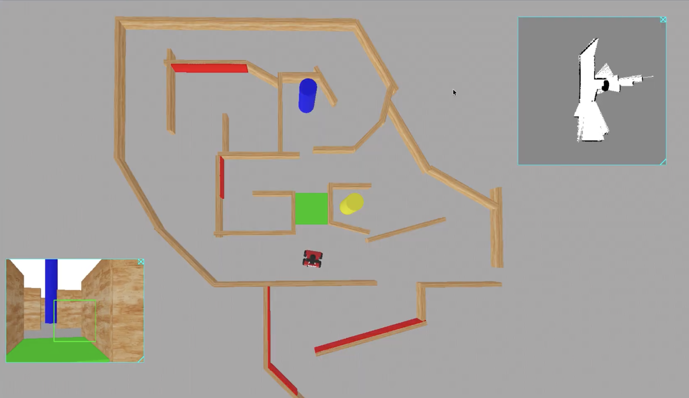

# autonomous_driving

Autonomous exploration and navigation for the RosBot in **5 different Webots mazes**.

## Goal

Navigate the robot from the **blue pillar** to the **yellow pillar** in the shortest possible simulation time while:

- Avoiding **green ground** regions
- Handling narrow / non-traversable passages
- Detecting **red walls** (dead ends) and replanning

## Approach

- **Mapping / exploration:** frontier-based exploration (closest frontier + selected farther frontiers for efficiency)
- **Planning:** A* on a maintained costmap (free / occupied / unknown)
- **Execution:** convert the planned A* path into waypoints and follow them sequentially
- **Perception:**
	- Camera detects blue/yellow pillars (intermediate + final goals)
	- Camera detects green ground and marks it as forbidden
	- Red walls indicate dead ends → trigger a 180° turn + replanning
	- Laser measurements are used to confirm red wall detection; cells are marked occupied only after sufficient red detection to reduce false positives

### Webots Supervisor usage

The Webots supervisor is used **only** to read the robot’s global position and orientation to reduce localization drift (no environment/robot modification).

## Mapping visuals

These are the generated maps used by the planner (converted to PNG so they render in Markdown):





## Results

Timing summary (Start→Blue, then Blue→Yellow):

| Environment | Start→Blue (s) | Blue→Yellow (s) | Total Time (s) |
| --- | --- | --- | --- |
| Maze 1 | 6:39:168 | 4:23:584 | 11:02:752 |
| Maze 2 | 8:43:264 | 4:54:272 | 13:37:536 |
| Maze 3 | 4:23:840 | 2:23:104 | 6:46:944 |
| Maze 4 | 3:12:128 | 2:28:704 | 5:40:832 |
| Maze 5 | 1:22:688 | 1:31:360 | 2:54:048 |

Qualitative observations:

- Green-ground avoidance succeeded
- Obstacle avoidance was precise across all environments; narrow passages were navigated smoothly

## Dependencies

- Webots (simulation)
- Python controller dependencies:
	- Webots Python API: `controller` (e.g., `Supervisor`, `Keyboard`)
	- `numpy`

It’s recommended to use a virtual environment.

## Robot configuration

Robot name must be set in the DEF field of your robot `.proto`:

```
DEF rosbot Robot { ... }
```

## Required displays

Add these to your map `.proto` to visualize the camera and the map:

```txt
# Camera display
CameraDisplay {
	name "CameraDisplay"
	width 640
	height 480
}

# Map display
MapDisplay {
	name "MapDisplay"
	width 300
	height 300
}
```

Important: save the file and reload the world for the displays to appear.

## How to run

1. Open a maze world in Webots (e.g. `Maze1/worlds/Maze1.wbt`, `Maze2/worlds/Maze2.wbt`, …).
2. Ensure the RosBot is present and named `rosbot`.
3. Run the controller script from Webots.
4. Verify `CameraDisplay` and `MapDisplay` are visible.

## Videos

[](https://drive.google.com/drive/folders/1wr3QS4YzxN2X6jKGdsdXy_vxPFZknrQB?usp=sharing)

Direct link: https://drive.google.com/drive/folders/1wr3QS4YzxN2X6jKGdsdXy_vxPFZknrQB?usp=sharing